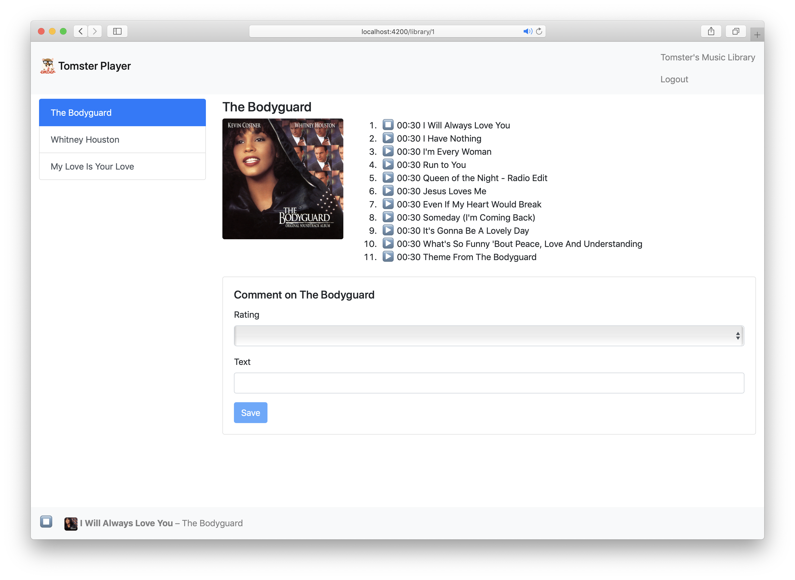

# Ember.js

Introduction

---

https://mainmatter.com  
@mainmatter

---

## Marco Otte-Witte

http://github.com/marcoow

@marcoow

---

## 2 days of Ember.js-debug

---

---

## Curriculum

---

### 9 blocks

each split into a presentation followed by a practice session

Note:

		pair up for the practice sessions

---

### 1 - Introduction

goes over Ember.js' history, its parts and release cycle

---

### 2 - Object Model

introduces the object model and tracked properties in detail

---

### 3 - Ember.js Basics

reviews Ember.js' core concepts

---

### 4 - Templates

covers Templating with Handlebars and Actions

---

### 5 - Routing

dives deep into routing, route hierarchies and outlets

---

### 6 - Ember Data

overviews the model layer of the framework, ways to customize interactions with the backend

Note:

		covers all aspects of Ember Data as well as introduces `JSON:API`

---

### 7 - Components

shows how to build complex applications as a connected system of components

Note:

		This is probably the most important and longest part of the whole workshop

---

### 8 - Services

goes through the theory and practice of Ember.js' services

---

### 9 - Testing

dives deep into testing applications

---

Everything we will tell you will be based on the latest release version of Ember.js and will also give an outlook on future versions

---

Of course you can take the workshop materials home for reference at the end

---

You will build your own music player in these practice sessions

---

 &shy;<!-- .element: class="r-stretch" --> 

* yes, it plays Whitney Houston only
* Yours might look different but should have the functionality in the end

---

Interrupt me for questions at any time!

---

### Have fun!

---

https://mainmatter.com  
@mainmatter
