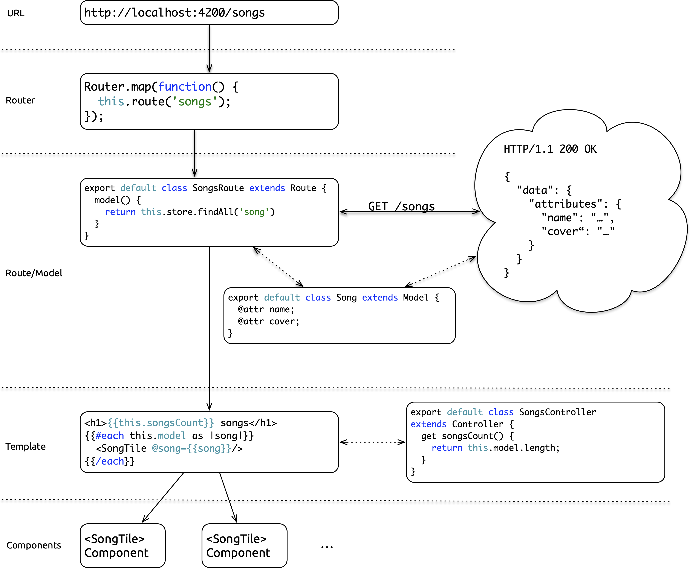
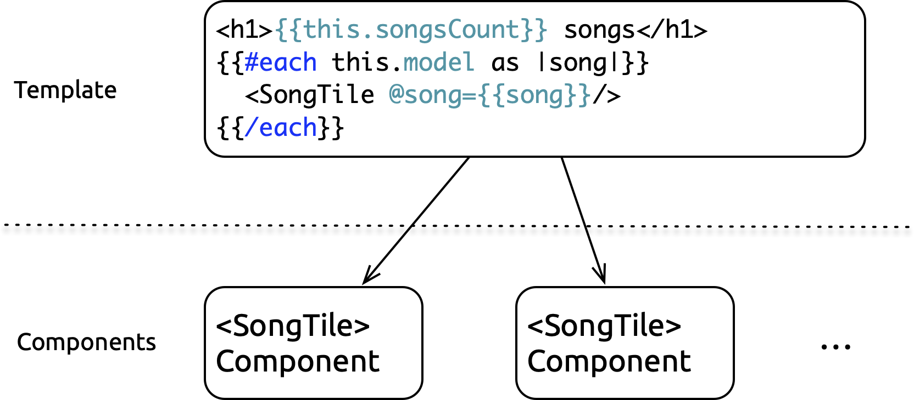

https://mainmatter.com

@mainmatter

---

# Ember.js Core Concepts

---

&shy;<!-- .element: class="r-stretch" --> 

---

## The Router

describes the application's route hierarchy and maps URLs to Ember.js routes

---

&shy;<!-- .element: class="r-stretch" --> 

---

## Routes

load models and render templates

---

&shy;<!-- .element: class="r-stretch" --> 

---

## Models

represent persistent state

---

&shy;<!-- .element: class="r-stretch" --> 

---

## Templates

render a DOM

---

&shy;<!-- .element: class="r-stretch" --> 

---

## Controllers

implement logic that can be used in templatesH

Note:

will be deprecated once routable components land and removed in the following major release

---

&shy;<!-- .element: class="r-stretch" --> 

---

## Components

combine a template and associated code as a reusable UI element

---

&shy;<!-- .element: class="r-stretch" --> 

---

&shy;<!-- .element: class="r-stretch" --> 

---

## Ember CLI

http://ember-cli.com

---

Ember CLI is Ember.js' command line interface and build tool

---

it provides a standard project/directory structure

---

`app/`

contains the application code

---

`app/app.js`

is the application's entry point

---

`app/index.html`

is the single page of the Single Page App which starts the Ember application

---

`app/styles/`

contains the application's stylesheets

Note:

the stylesheets can also be written in LESS or SASS

---

`app/router.js`

contains the route configuration; the routes defined here correspond to routes in `app/routes/`

---

`app/routes/`

contains the application's routes

---

`app/templates/`

contains the application's route templates

---

`app/models/`

contains the application's models

---

`app/controllers/`

contains the application's controllers

---

`app/components/`

contains the application's components

---

`dist/`

is where the distributable which is deployed to a server is placed by the build process

---

`public/`

contains static assets such as images, fonts etc.

---

for the above example app this looks roughly like this:

```txt
app/
├── controllers/
│   └── songs.js
├── components/
│   └── song-tile/
|       └── template.hbs
├── models/
│   └── song.js
├── routes/
│   └── songs.js
├── styles/
│   └── app.css
└── templates/
    ├── application.hbs
    └── songs.hbs
├── app.js
├── index.html
├── router.js
```

<!-- .element: class="r-stretch" -->

Note:

(some files are left out intentionally)

---

Each of the (JavaScript) files in `app/` is a separate JavaScript module

---

All these modules are transpiled to AMD modules and combined in one file

`<app-name>.js` that's loaded from `index.html`

---

```html
<script src="assets/vendor.js"></script>
<script src="assets/song-list.js"></script>
```

Note:

vendor.js contains Ember itself and other dependencies

---

```js
// ...
define(
  'song-list/models/song',
  ['exports', 'ember-data'],
  function(exports, _emberData) {
    var attr = _emberData['default'].attr;
    exports['default'] = _emberData['default'].Model.extend({
      name: attr('string'),
      cover: attr('string')
    });
  }
);
// ...
```

Note:

don’t need to understand this in detail

---

Ember CLI also provides a command line utility for common tasks

---

```txt
ember new <my-app>
```

creates a new application

---

```txt
ember test
```

runs the application's tests

Note:

Also shortcutted as `npm test`.

---

```txt
ember serve
```

or simply

```txt
ember s
```

starts the application

Note:

Also shortcutted as `npm start`.

---

```txt
ember generate <element>
```

or simply

```txt
ember g <element>
```

creates an element of the application incl. tests etc., e.g. controllers, components etc.

---

## Demo

https://github.com/simplabs/ember-workshop/tree/master/examples/core-concepts

---

## Practice Session

Use the Ember Inspector to look at the internals of the application and understand what is going on

---

&shy;<!-- .element: class="r-stretch" --> 

https://mainmatter.com

@mainmatter